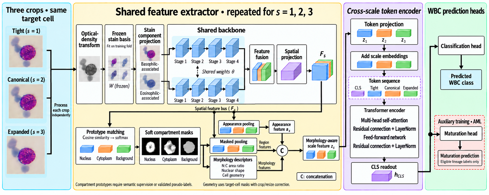
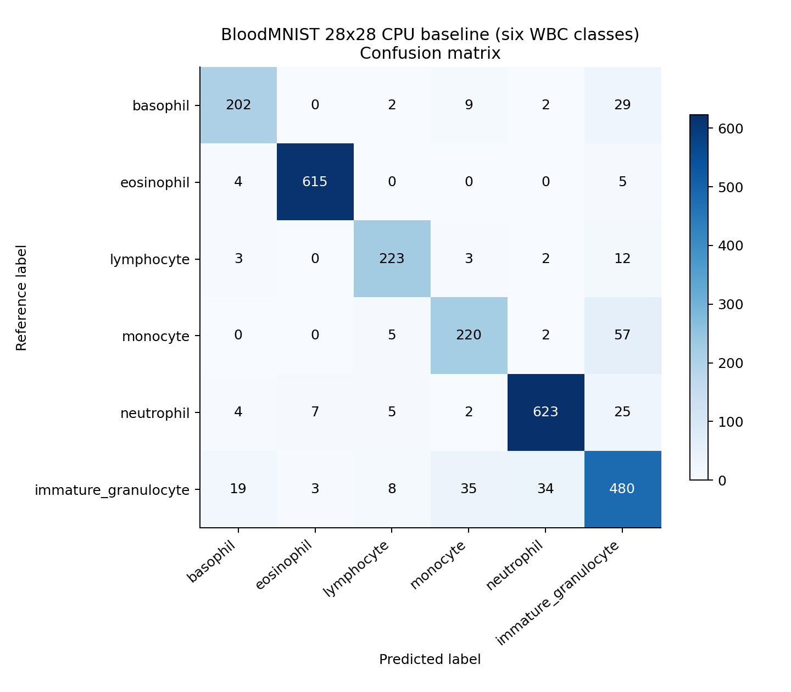

# White blood cell classification with stain and morphology

[](https://github.com/drsyedkhasim031-hub/wbc-morphology-multiscale/actions)

A runnable PyTorch reference implementation for **Integrating Stain Information and Cell Morphology Across Multiple Scales for White Blood Cell Classification**. It includes model code, dataset preparation, training, validation, testing, statistics, ablations, calibration, robustness, morphology validation, plots, and inference.

**Research status:** the supplied manuscript describes a proposed specification and explicitly states that its existing results lack verified experimental provenance. This repository implements that specification anew. The manuscript's reported scores are **not reproduced results**. Original full-dataset training and clinical validation remain outstanding.



*Supplied manuscript illustration, retained as reference. See [implementation decisions](docs/implementation.md) for the operators actually implemented.*

## What is included

| Area | Implementation |
|---|---|
| Proposed model | Three crops, training-fitted OD basis, two shared ConvNeXt-T streams, 36 compartment prototypes, eight geometry descriptors, 384-wide scale Transformer, restricted maturation head |
| Data | Raabin five-class, PBC six-class, AML fifteen-class; common-five mapping; decoded-pixel hashing; pHash candidate screening; connected patient/slide/duplicate groups |
| Protocols | Preserved Raabin Test-A, PBC holdout, AML five outer folds, source-only leave-one-dataset-out evaluation |
| Training | Weighted smoothed CE, scale consistency, prototype regularization, eligible Huber loss; AdamW, warm-up/cosine; five-seed experiment planner |
| Validation and testing | Validation macro-F1 checkpoint selection, validation-only temperature scaling, case-level probabilities, OOF aggregation, difficult pairs |
| Statistics | Paired group bootstrap for accuracy/macro-F1, cluster permutation, restricted exact McNemar, Holm adjustment |
| Further analysis | Dice/IoU/boundary F1 and N:C agreement, fixed image corruptions, reliability/risk–coverage plots, end-to-end profiling, provisional mask overlays |
| Comparators | ResNet-50, MobileNetV3-L, EfficientNet-B0, EfficientNetV2-S and Swin-T adapters; RGB baseline and architectural/objective ablations |
| Research assets | All nine supplied figures, 16 reported tables, provenance notes, dataset audit, notebook, executed CPU results, automated tests |

## Results actually executed here

| Experiment | Scope | Result |
|---|---|---|
| Classical CPU baseline | Six WBC classes from **28×28 BloodMNIST**, derived from PBC; 9,223 fitting, 1,321 validation, 2,640 test cells after exact-duplicate exclusions | **89.51% accuracy; 88.22% macro-F1** |
| Proposed-path integration run | Reduced debug encoder, 64-pixel inputs enlarged from BloodMNIST, 72/24/24 cells, two epochs | End-to-end training, selection, calibration and prediction artifacts produced; **not a benchmark** |
| Full architecture verification | ConvNeXt-T with three 224-pixel crops and two component streams | Tensor dimensions and loss/gradient checks tested |

The CPU baseline uses standardized color/spatial features and logistic regression, with regularization selected on validation data. It is a separate demonstration; its split and image resolution differ from the paper. Eight fitting and one validation exact duplicates were excluded to protect the fixed test set. No patient-independent claim is made. [Predictions and metrics](results/executed/bloodmnist_cpu/) · [paired bootstrap](results/executed/bloodmnist_cpu/paired_bootstrap_vs_majority.json) · [run provenance](results/executed/bloodmnist_cpu/provenance.json).



The paper's 99.72% / 99.85% / 98.50% native scores are stored only under [reported manuscript results](results/reported/README.md). They are not claims about this code.

## Install

Python 3.10 or newer. Choose an appropriate CPU/CUDA PyTorch build for your machine, then:

```bash
git clone https://github.com/drsyedkhasim031-hub/wbc-morphology-multiscale.git
cd wbc-morphology-multiscale
python -m venv .venv
# Linux/macOS: source .venv/bin/activate
# Windows PowerShell: .venv\Scripts\Activate.ps1
pip install -e ".[dev]"
pytest -q
wbc --help
```

The full configuration downloads the official ConvNeXt-T ImageNet checkpoint on first use. Set `model.pretrained: false` only for an explicitly documented untrained initialization. `backbone: debug` is exclusively for fast integration checks. Original experiments require substantial GPU time and sufficient memory for six backbone passes per cell. Batch size 24 may require a large GPU; reducing it changes the recipe and must be reported.

## Reproduce the CPU demonstration

```bash
wbc download --demo --out data/bloodmnist.npz
python scripts/demo_baseline.py --data data/bloodmnist.npz --out runs/cpu_baseline
python scripts/smoke_train.py --data data/bloodmnist.npz --work runs/smoke_data --results runs/integration_results
```

Use fresh output directories for training. The baseline stores portable numeric model coefficients, validation/test probabilities, calibration, plots and a 2,000-draw paired bootstrap. `notebooks/quickstart.ipynb` contains the same entry points.

## Prepare original datasets

See [dataset acquisition and audit](docs/datasets.md). Download the original releases into `data/raabin`, `data/pbc`, and `data/aml`; full archives are deliberately not committed. Dataset licenses are separate from the code license.

```bash
wbc sources
wbc manifest --dataset raabin --root data/raabin --metadata data/raabin_metadata.csv --out data/manifests/raabin.csv
wbc manifest --dataset pbc --root data/pbc --out data/manifests/pbc.csv
python scripts/prepare_aml_metadata.py --annotations data/aml/annotations.dat --out data/aml_metadata.csv
wbc manifest --dataset aml --root data/aml --metadata data/aml_metadata.csv --out data/manifests/aml.csv
```

Raabin metadata must identify `collection=train` or `test_a` when those exact folder names cannot be inferred. Patient/slide IDs are optional but must come from verified source metadata. Unknown IDs stay blank. Counts are checked against the manuscript, with actual discrepancies recorded rather than silently repaired.

```bash
wbc duplicates --manifest data/manifests/raabin.csv data/manifests/pbc.csv data/manifests/aml.csv --out data/duplicate_candidates.csv
# Visually adjudicate candidate pairs. Store confirmed links only as id_a,id_b.
wbc split --manifest data/manifests/raabin.csv --protocol raabin --out data/splits/raabin.csv
wbc split --manifest data/manifests/pbc.csv --protocol pbc --out data/splits/pbc.csv
wbc split --manifest data/manifests/aml.csv --protocol aml --fold 1 --out data/splits/aml_fold1.csv
wbc split --manifest data/manifests/raabin.csv data/manifests/pbc.csv data/manifests/aml.csv --protocol lodo --target raabin --out data/splits/lodo_raabin.csv
```

Repeat AML splitting for folds 2–5 and LODO for targets `pbc` and `aml`. Use `--links data/confirmed_links.csv` when links apply to the supplied manifests. Exact duplicates join automatically; perceptual-hash candidates do not. Group integrity can change nominal counts and cause missing classes; training rejects a missing fitting class.

## Train, validate and test

Edit the dataset roots and manifest paths in `configs/`. Paths are relative to the command's working directory.

```bash
wbc train --config configs/pbc.yaml --seed 1729 --out runs/pbc_full_seed1729
wbc evaluate --checkpoint runs/pbc_full_seed1729/calibrated.pt --manifest data/splits/pbc.csv --split test --out runs/pbc_retest
wbc figures --predictions runs/pbc_full_seed1729/test_predictions.csv --classes pbc --out runs/pbc_figures
```

`train` completes all configured epochs, selects the earliest best validation macro-F1 checkpoint, fits a positive temperature only on validation logits, and evaluates the untouched test partition. LODO selection gives each source domain equal weight. It writes `history.csv`, fitted preprocessing, a copied manifest, configurations/environment, `best.pt`, `last.pt`, `calibrated.pt`, predictions and metrics. The final checkpoint stores the fitted basis and descriptor statistics. Test results do not change selection or calibration.

```bash
# Generate reviewable configurations for five seeds; add --execute to train them.
python scripts/run_experiments.py --task pbc --variants full no_stain no_descriptors classification_only --out runs/pbc_matrix
python scripts/run_experiments.py --task aml --out runs/aml_fivefold --execute
python scripts/run_experiments.py --task lodo_raabin --backbones convnext_tiny resnet50 swin_t --out runs/lodo_comparators
```

## Statistical comparisons and other analyses

```bash
wbc metrics --predictions runs/fold1/test_predictions.csv runs/fold2/test_predictions.csv runs/fold3/test_predictions.csv runs/fold4/test_predictions.csv runs/fold5/test_predictions.csv --classes aml --out runs/aml_oof_metrics.json
wbc statistics --a runs/full/test_predictions.csv --b runs/baseline/test_predictions.csv --classes pbc --draws 2000 --permutation --out runs/paired_statistics.json
wbc pairs --predictions runs/aml/test_predictions.csv --classes aml --out runs/difficult_pairs.json
python scripts/infer.py --checkpoint runs/pbc_full_seed1729/calibrated.pt --images path/to/cell.jpg --out runs/inference
wbc profile --checkpoint runs/pbc_full_seed1729/calibrated.pt --images path/to/cell.jpg --batch-size 1 --device cuda --out runs/profile.json
```

For multiple training seeds, pass all corresponding prediction files to `--a` and `--b`. Comparisons reject mismatched IDs, labels, groups and seeds. Use `--equal-domains` for external domain-weighted bootstrap comparisons. Do not use folds as independent samples. See [evaluation commands and definitions](docs/evaluation.md) for mask validation, corruption experiments and statistical assumptions.

## Repository map

```text
src/wbc/          Core model, data, geometry, losses, training and analysis
configs/          Full native and LODO recipes
scripts/          Experiment matrix, CPU demos, inference and AML metadata conversion
tests/            Numerical, leakage, gradient, backbone and protocol checks
notebooks/        Executable walkthrough
docs/             Protocol, dataset audit, implementation decisions, evaluation
figures/paper/    Unchanged supplied manuscript illustrations with provenance
results/reported/ Manuscript tables, explicitly unverified
results/executed/ Actual CPU outputs, probabilities, coefficients and plots
```

This is research software for cropped-cell representation experiments. Classification-trained prototype banks have provisional anatomical meanings; their overlays and N:C measurements need independent reference annotation. No diagnostic or patient-level performance is established. See [limitations and implementation decisions](docs/implementation.md), [data rights](DATA_LICENSES.md), and [citation metadata](CITATION.cff).
